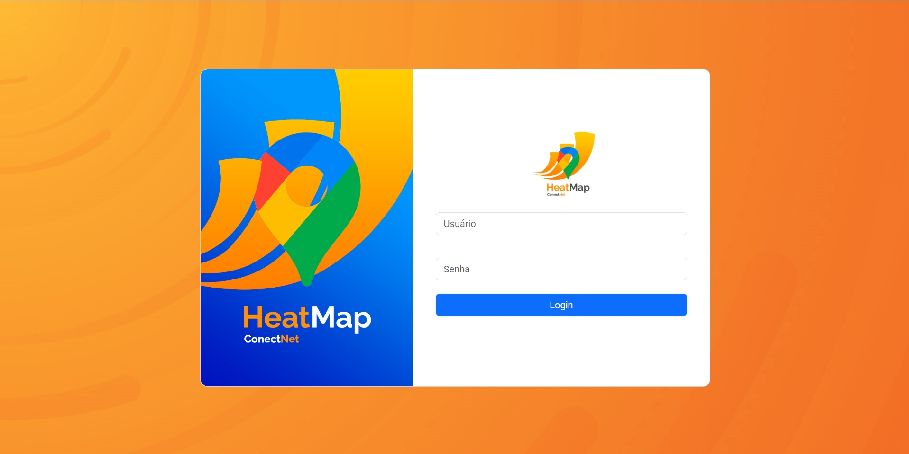

APLICATIVO TÉCNICO PARA PROVEDOR.

Aplicativo de uso técnico, ainda em desenvolvimento, com intuito de facilitar a pesquisa e manipulação de informações como a localização de clientes e caixas de atendimento (CTOS) dentro da rede de um provedor de fibra óptica. O aplicativo usa a API do Google Maps para gerar o mapa e fixar os marcadores que indicam a localização dos pontos de acesso dentro da rede. As informações contendo a localização de cada caixa de atendimento e seus respectivos clientes, é fornecida pelo consumo da API do TOMODAT, sistema que permite projetar redes FTTH. A aplicação é construída com as tecnologias: JavaScript, HTML, Bootstrap no Front-end e NodeJS com Express e MongoDB no Back-end.

1. Tela de login feita com bootstrap, login com JWTauth no back.
(imagens acima)

2. Tela inicial da aplicação. Realizado o login, o sistema carrega as informações do banco de dados e gera um mapa de calor. As áreas mais quentes correspondem a uma maior concentração de caixas de atendimento. Cada caixa de atendimento abrange um raio de 200m no mapa, facilitando a visualização da viabilidade de atendimento de cada caixa, tornando o processo de vendas mais rápido. (imagens acima). 

3. Barra lateral com formulário para pesquisa de clientes e caixas de atendimento. Neste componente são exibidos dois formulários de pesquisa. Ao pesquisar pelo nome de um cliente ou pelo código de uma CTO, o sistema exibe uma lista com os resultados correspondentes. Ao lado do nome é exibido um botão que direciona o usuário para localização do item pesquisado. Na pesquisa de cliente é possível optar pela localização da caixa de atendimento na qual o cliente está inserido ou, clicando no botão (cli), direcionar o usuário para localização exata da casa do cliente. Caso a localização não tenha sido fornecida, o usuário poderá inserir uma nova localização ou atualizar uma localização já existente. (imagens acima). 

4. Tela da funcionalidade clientes, ao clicar no botão "clientes" abre um modal com botões para atualizar a localização do cliente, abrir no Maps a localização do cliente e um mini-mapa com a localização do cliente na tela, caso não tenha cadastrada a localização do cliente abre um modal com um botão para adicionar a localização do cliente (imagens acima).

5. Tela da pesquisa de CTO's, retorna a CTO correspondente com o texto pesquisado, indicando a cidade que se encontra a CTO, ao clicar no botão CTO centraliza o mapa na CTO em questão (imagens acima).

6. À direita no canto superior, há um campo de pesquisa de CTO's, se digitar apenas "R" no campo marca todas as CTO's no mapa (como na imagem), podendo pesquisar também as CTO's por este campo, mas sem centralizar na CTO (imagens acima).

7. Modal que aparece ao clicar em uma CTO no mapa, no modal vemos o nome da CTO em azul, pois é um link para a localização da CTO no Google Maps.
* Ao lado uma engrenagem que ativa a função "bater CTO" que foi desenvolvida pensando nos técnicos de campo que usam o aplicativo para conferir os clientes na CTO, ao ativar essa função, ao lado do nome vemos uma caixa de marcação que quando selecionada risca o nome do cliente, permitindo assim uma forma mais rápida de bater a CTO de fato. 
* No modal também consta a quantidade de vagas na CTO, a quantidade de clientes na CTO. 
* Ao lado do cliente "TESTE APP" vemos dois botões, são botões para copiar o nome do cliente de forma específica, pois como usamos integradores que precisam de uma nomenclatura diferente servem para facilitar a vida dos técnicos ao procurar o cliente no integrador,
* Vemos também o botão de fechar a CTO e o de Add cliente, que serve para conectar o cliente a CTO (imagens acima).  

8. Modal da função Add cliente que esta presente dentro do Modal da CTO, podemos ver 4 campos no modal, o primeiro é o único que pode ser preenchido, o Nome do cliente, caixa de atendimento, Lat e Lng são todos preenchidos automaticamente pelo sistema para evitar erro humano (imagens acima).

9. Funções da parte do Heatmap, na imagem mostra as funções do Heatmap:
* On/Off HeatMap - ativa e desativa o mapa de calor.
* Atualizar ctos - atualiza manualmente os dados, recarregando o mapa.
* Mudar o gradiente - muda a cor do gradiente do mapa de calor.
* Mudar o raio - muda o raio do mapa de calor (por padrão é fixo em 200mt).
* Mudar a opacidade - muda a opacidade do mapa de calor, deixando a cor mais forte e não conseguindo ver o mapa por baixo do mapa de calor.

10. Função que centraliza o mapa na posição do usuário, ao clicar no botão "ir até mim" gera um marcador no ponto onde o usuário está e centraliza o mapa no marcador (imagens acima).

11. Dashboard de controle de usuários, nela podemos ver o nome do usuário, categoria e podemos editar o usuário, somente usuários da categoria ADM tem acesso a esta dashboard (imagens acima).

12. Tela de logs de clientes adicionados a CTO, usada para verificação e correção de erros, nesta tela sabemos a CTO, Cliente, Usuário, horário, data e lat/lng das adições no sistema, fazendo assim ficar mais fácil corrigir erros de usuário (imagens acima).

(iniciado o desenvolvimento em 11/2022).

(30/01/2023) NOTA: O aplicativo ainda se encontra em desenvolvimento, já temos novas features planejadas, no momento estamos trabalhando para permissão de exclusão de clientes da CTO, e no tracking dos usuários do sistema com um painel, permitindo que o Gerente das equipes externas acompanhe as últimas localizações dos técnicos, facilitando a gerência de problemas na rede e otimizando o tempo de resposta da empresa.

Features já planejadas:
* Modulo NFe.
* Painel de gerência de Carros (serviços efetuados, com identificação pela placa e vinculando ao técnico que usa/usou no período.)
* Painel de Estoque
* upload/download de fotos de instalações, referências de residências, etc.

Responsáveis pelo desenvolvimento:

FRONT-END: Sandro Galiazzi - https://github.com/sandrogaliazzi

BACK-END: Guilherme Schmidt - https://github.com/schmidt4win
